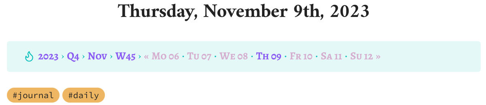
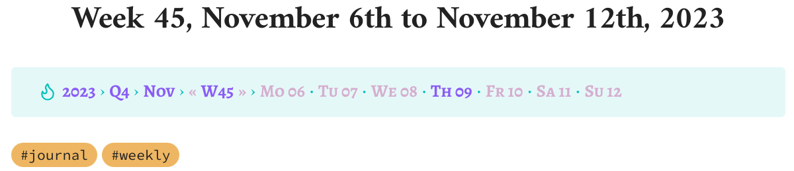
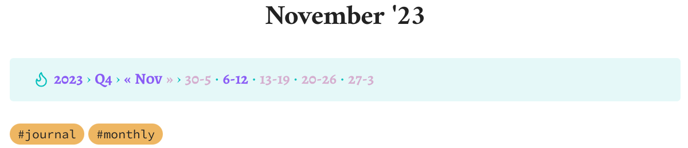
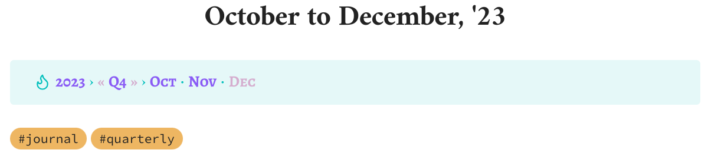
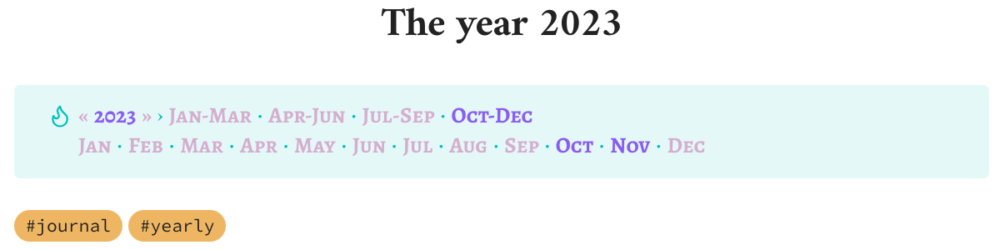
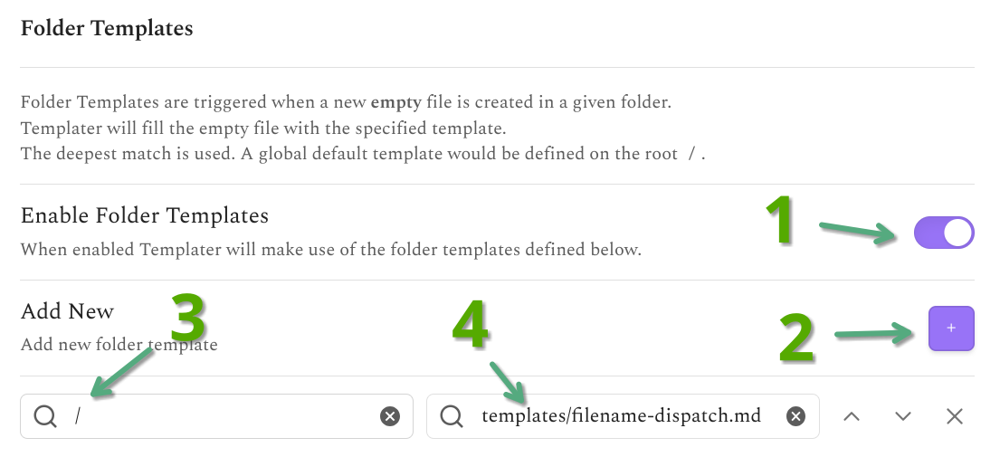

# A calendar navigation bar for your obsidian journal / periodic notes

## Features

- Let's you navigate upwards, e.g. from days to weeks, months, quarters and years etc.
- Includes downwards navigation, i.e. going from year to quarter or month to week to day
- Sideways navigation brings you quickly from Monday to the previous Sunday or from September to August or October
- If a note does not exist yet, it will be created with the correct template when you click on the link
- Works with the Calendar plugin without any extra configuration
- Reads all settings such as patterns dynamically from your settings, so you don't have to adapt the templates to customize the note format, for example (see step 4 below)
- Looks great!

## Installation

First, you need two plugins: [Periodic Notes](https://github.com/liamcain/obsidian-periodic-notes) and [Templater](https://github.com/SilentVoid13/Templater).

Then:
1. Copy the `templates` directory into your vault and configure Templater to use `templates` as the `Template folder location`. Alternatively, copy the individual templates into your existing template folder.
2. Enable `Trigger Templater on new file creation` in the Templater settings
3. Configure `templates/filename-dispatch.md` as a folder template for `/` in Templater

   
4. (Optionally,) customize your Periodic Notes template formats. If you don't, the templates will use the default values. If you use a structure that puts your notes in subdirectories such as

  - daily: `[journal]/Y/MM/Y-MM-DD`
  - weekly: `[journal]/GGGG/MM/GGGG-[W]WW`
  - monthly: `[journal]/Y/Y-MM`
  - quarterly: `[journal]/Y/Y-[Q]Q`
  - yearly: `[journal]/Y`

  keep in mind that the filenames should be unique, not just the whole path. So the daily format `[journal]/Y/MM/DD` would be invalid, because the 2nd of February and March would both be saved in `02.md`, which makes linking much more of a hassle.

## Credits

The initial idea for a navigation bar as well as the use of filename dispatching came from ljavuras' [obsidian-power-tools](https://github.com/ljavuras/obsidian-power-tools). The design is [inspired by screenshots](https://imgur.com/a/tblVLUu) [posted to reddit](https://www.reddit.com/r/ObsidianMD/comments/10gf149/quick_navigation_between_periodic_notes/j57jewe) by `u/tricky-vixen`.
